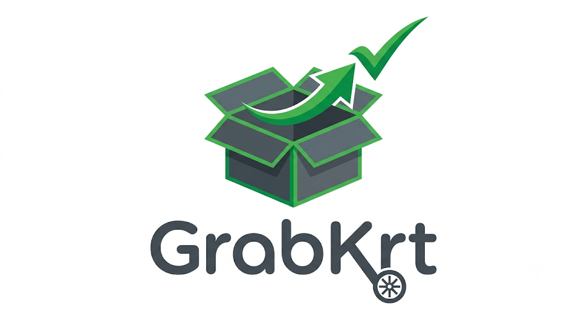
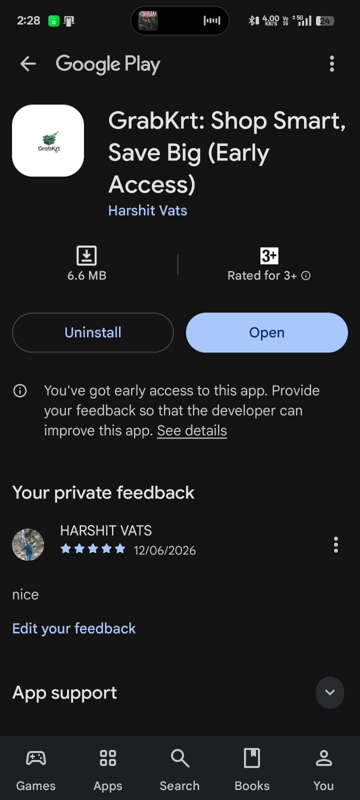

# GrabKrt User App 🛒

The primary shopping interface designed for a seamless, fast, and interactive user experience. Part of the GrabKrt hyper-local e-commerce ecosystem.

> **Status:** ✅ Successfully completed **14 days of Closed Testing** on Google Play Console and is now **live in Production**.
---


---
**Dashboard Proof:**

<table>
  <tr>
    <td></td>
    
  </tr>
 
</table>

## 🏗️ Tech Stack

* **Frontend Framework:** Flutter (Dart) — Cross-platform UI (Android & iOS)
* **State Management:** GetX (reactivity, dependency injection, route management)
* **Backend & Database:** Firebase Cloud Firestore (NoSQL), Firebase Authentication
* **Cloud Functions & Notifications:** Firebase Cloud Messaging (FCM) & Node.js for real-time transactional push alerts
* **Mapping & Location:** Google Maps API, `geolocator`, `url_launcher` (for one-click navigation)
* **Payment Gateway:** Razorpay API (prepaid orders & dynamic QR code generation)

---

## ✨ Features

* **Dynamic Location Picker:** Users can dynamically pick their exact delivery location on an interactive Google Map or fetch current GPS coordinates.
* **Smart Shopping:** Browse categories, filter by brands, view interactive promotional banners, and manage a cart with real-time stock validations.
* **Flexible Payments:** Supports both "Prepaid" (via Razorpay) and "Cash on Delivery" (COD).
* **Live Order Tracking:** Real-time UI updates (Pending → Accepted → Picked Up → Delivered) synced directly from the Delivery App.

---

## ⚙️ Setup & Installation

### Prerequisites
* Flutter SDK (^3.8.1 or higher)
* Firebase CLI installed and logged in
* Google Cloud Console account (for Maps API)
* Razorpay Dashboard account (for Payment Keys)

### Steps to Run
1. **Clone the repository:**
```bash
   git clone https://github.com/your-username/grabkart-user-app.git
```
2. **Install dependencies:**
```bash
   flutter pub get
```
3. **Configure Firebase:**
   Ensure `google-services.json` (Android) and `GoogleService-Info.plist` (iOS) are placed in their respective app directories. This app must connect to the same Firebase project as the Admin and Express apps for the Dual-Write strategy to work.
4. **Environment Variables & Keys:**
   * Insert your Google Maps API Key in `AndroidManifest.xml` (whitelist SHA-1 App Signing and Upload keys on Google Cloud Console).
   * Update your Razorpay Test/Live Keys in the Constants/Controller files.
5. **Run the app:**
```bash
   flutter run
```

---

## 🛡️ Database Security (Firestore Rules)

Utilizes strict Role-Based Access Control (RBAC). The `Users -> Orders` sub-collection maintains isolated, private order histories for each end consumer.

---

## 🎥 Demo Video

Watch the app in action here: **[Demo Video Link](https://drive.google.com/file/d/1xBh-d7LEByiDTw7x-J9TLnswTJhb5_TS/view?usp=sharing)**

---

**Developed & Maintained by:** Harshit Vats
**Project:** GrabKrt Ecosystem — User App
